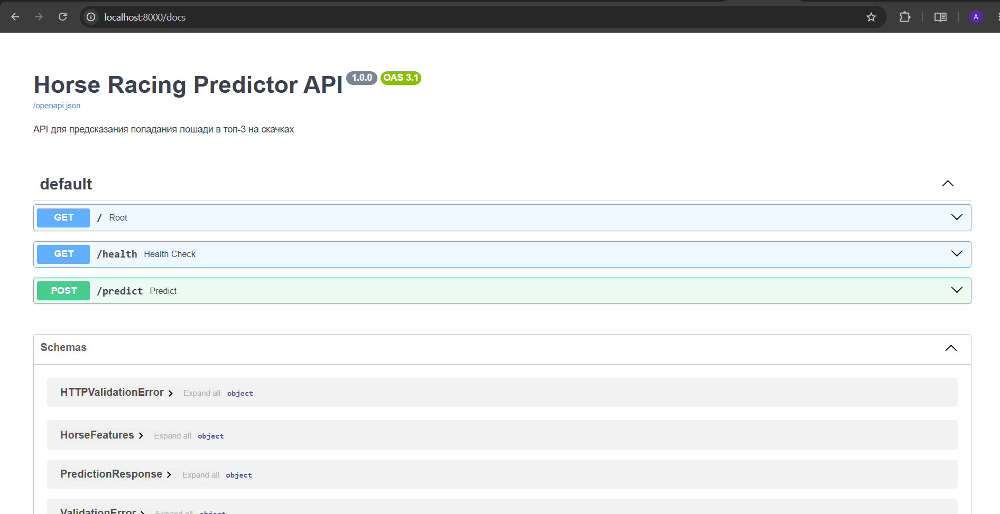
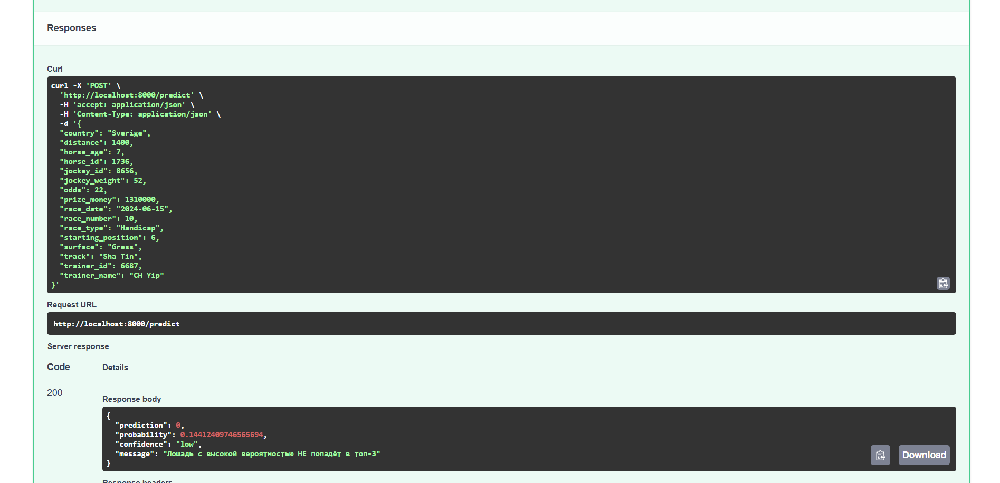

# Отчёт по проекту

**Студент:** Щерба Алика Алексеевна
**Группа:** БИВ235

---

## 1. Введение и постановка задачи

### Цель проекта

Разработать модель машинного обучения для прогнозирования попадания лошади в топ-3 на скачках на основе исторических данных. Такая модель может быть использована для:
- Анализа факторов, влияющих на успех лошади
- Поддержки принятия решений при ставках на скачки
- Помощи тренерам и жокеям в оценке перспектив лошади

### Формулировка задачи

**Тип задачи:** Бинарная классификация

**Целевая переменная:** `target = 1`, если лошадь финишировала в топ-3 (места 1, 2 или 3), и `target = 0` в противном случае.

**Исходные данные:** 27 008 записей о скачках с 21 признаком (дата, ипподром, дистанция, вес жокея, возраст лошади, коэффициент ставок и др.).

### Обоснование метрики качества

Датасет имеет дисбаланс классов:
- Класс 0 (не топ-3): ~75%
- Класс 1 (топ-3): ~25%

**Основная метрика: ROC-AUC**
- Не зависит от порога классификации
- Устойчива к дисбалансу классов
- Позволяет оценить способность модели разделять классы при любом пороге

**Дополнительные метрики:**
- **Precision** — доля верно предсказанных топ-3 среди всех предсказанных как топ-3. Важна, т.к. ложные срабатывания дороги 
- **Recall** — доля найденных топ-3 среди всех реальных топ-3. Важна,чтобы не пропускать потенциальных победителей
- **F1-score** — среднее precision и recall, полезна для сравнения моделей

**Приоритет:** ROC-AUC → F1 → Precision/Recall. При равном ROC-AUC выбираем модель с лучшим F1.

---

## 2. Поиск и описание данных

### Источник данных

Источник — исторические данные о скачках в Гонконге (ипподромы Sha Tin и Happy Valley) за период с сентября 2017 по июнь 2020 года c Kaggle
Вот краткое обоснование выбора данных:

**Почему выбран этот датасет:**

1. **Размер** — 27 008 записей (достаточно для обучения, нет переобучения)

2. **Целевая переменная** — чёткое определение топ-3 (бинарная классификация 0/1)

3. **Богатый набор признаков** — возраст, вес жокея, коэффициенты, покрытие, дистанция

4. **Качество** — минимум пропусков, готов к использованию

6. **Актуальность** — относительно свежие данные 

### Описание датасета

**Объём:**
- Строки: 27 008
- Столбцы: 21

**Признаки:**

| Признак | Тип | Описание |
|---------|-----|----------|
| Date | datetime | Дата проведения скачки |
| Track | categorical | Ипподром (Sha Tin / Happy Valley) |
| Race Number | int | Номер заезда |
| Distance | int | Дистанция заезда (метры) |
| Surface | categorical | Тип покрытия дорожки |
| Prize money | int | Призовой фонд |
| Starting position | int | Стартовая позиция |
| Jockey | categorical | Имя жокея |
| Jockey weight | int | Вес жокея (кг) |
| Country | categorical | Страна жокея |
| Horse age | int | Возраст лошади |
| TrainerName | categorical | Имя тренера |
| Race time | str | Время заезда (удалён из-за data leakage) |
| Path | int | Траектория движения (удалён) |
| Final place | int | Итоговое место (целевая переменная) |
| FGrating | int | Рейтинг лошади (удалён) |
| Odds | float | Коэффициент ставки |
| RaceType | categorical | Тип заезда |
| HorseId | int | Идентификатор лошади |
| JockeyId | int | Идентификатор жокея |
| TrainerID | int | Идентификатор тренера |
---

## 3. Обработка и подготовка данных

### Полная очистка

**Пропуски:**
- Исходно пропусков не было во всех 21 столбцах

**Дубликаты:**
- Дубликаты отсутствуют (проверено через `df.drop_duplicates()`)

**Выбросы:**
- Анализ выбросов проводился через визуализацию (`boxplot` для `jockey_weight` и `horse_age`)
- Экстремальные значения не удалялись, так как они могут быть информативными для модели
- Использованы устойчивые к выбросам модели (Gradient Boosting)

**Типы данных:**
- `date` приведён к `datetime`
- `odds` преобразованы из строк в `float64`
- `horse_age` извлечён как числовое значение из строки

**Удаление признаков, вызывающих data leakage:**
- `race_time` — время заезда неизвестно до его завершения
- `path` — траектория движения неизвестна до заезда
- `fgrating` — рейтинг лошади вычисляется после заезда

### Работа с фичами (Feature Engineering)

**Исходное количество признаков:** 21

**Созданные признаки:**
- `year`, `month`, `day_of_week`, `day_of_year`, `race_season` — временные признаки для учета сезонности
- `prize_per_distance = prize_money / distance` — призовые на метр дистанции
- `jockey_weight_per_age = jockey_weight / horse_age` — отношение веса жокея к возрасту лошади

**Итоговое количество признаков после feature engineering:** 24

### Визуализации

В рамках EDA построены следующие графики:
- Распределение целевой переменной (`target_distribution.png`)
- Распределение дистанции гонок (`distance_distribution.png`)
- Распределение коэффициентов (`odds_distribution.png`)
- Вероятность попадания в топ-3 по типу покрытия (`target_by_surface.png`)
- Вероятность попадания в топ-3 по ипподрому (`target_by_track.png`)
- Матрица корреляций числовых признаков (`numeric_correlation_matrix.png`)
- Boxplot'ы: вес жокея vs target, возраст лошади vs target

### Сплит данных

**Стратегия разбиения:** Временной сплит (chronological split) для предотвращения data leakage.

| Выборка | Доля | Строк | Период |
|---------|------|-------|--------|
| Train | 70% | 18 905 | 03.09.2017 — 16.10.2019 |
| Validation | 15% | 4 051 | 16.10.2019 — 19.02.2020 |
| Test | 15% | 4 052 | 19.02.2020 — 21.06.2020 |

**Защита от data leakage:**
- Разбиение по дате — обучающая выборка содержит только прошлые данные
- Удалены признаки, которые становятся известны только после заезда (`race_time`, `path`, `fgrating`)
- Колонка `date` удалена из всех выборок после сплита

---
## 4. Baseline-модель

**Модель:** Логистическая регрессия (LogisticRegression) с параметрами:

- `solver='liblinear'`
- `class_weight='balanced'`
- `random_state=42`

**Результаты:**

| Выборка | ROC-AUC | F1 | Precision | Recall |
|---------|---------|-----|-----------|--------|
| Validation | 0.767 | 0.513 | 0.371 | 0.830 |
| Test | 0.767 | 0.519 | 0.371 | 0.862 |

**Цель baseline:** 
Точка отсчёта для сравнения с более сложными моделями. Логистическая регрессия показывает высокий recall (0.83), но низкую precision (0.37), что означает много ложных срабатываний.
---

## 5. Эксперименты

### Гипотезы и эксперименты

#### Эксперимент 1: Сравнение алгоритмов (без hyperparameter tuning)

**Гипотеза:** Ансамблевые методы (Random Forest, Gradient Boosting, XGBoost) покажут результат лучше базовой логистической регрессии.

**Как проверялось:** Обучены модели с параметрами по умолчанию, оценены на валидационной выборке.

| Модель | ROC-AUC | F1 | Precision | Recall |
|--------|---------|-----|-----------|--------|
| Logistic Regression | 0.768 | 0.513 | 0.370 | 0.835 |
| Random Forest | 0.747 | 0.000 | 0.000 | 0.000 |
| Gradient Boosting | 0.784 | 0.413 | 0.618 | 0.310 |
| KNN | 0.565 | 0.238 | 0.333 | 0.185 |
| XGBoost | 0.781 | 0.391 | 0.633 | 0.283 |

**Результат:** Gradient Boosting показал наилучший ROC-AUC (0.784). Random Forest при параметрах по умолчанию не предсказал ни одного класса 1 (F1 = 0), что говорит о необходимости настройки.

---

#### Эксперимент 2: Перебор гиперпараметров

**Гипотеза:** Настройка гиперпараметров улучшит качество моделей.

**Как проверялось:** Использован `ParameterGrid` из sklearn для перебора параметров:

| Модель | Параметры |
|--------|-----------|
| Logistic Regression | `C = [0.1, 1, 10]` |
| Random Forest | `max_depth = [5, 10, None]` |
| Gradient Boosting | `learning_rate = [0.05, 0.1]` |
| KNN | `n_neighbors = [5, 10, 15]` |
| XGBoost | `learning_rate = [0.05, 0.1]`, `max_depth = [3, 5]` |

**Результат (лучшие параметры по ROC-AUC):**

| Модель | Лучшие параметры | ROC-AUC |
|--------|------------------|---------|
| Gradient Boosting | `learning_rate=0.05, n_estimators=100` | 0.784 |
| XGBoost | `learning_rate=0.05, n_estimators=100` | 0.781 |
| Logistic Regression | `C=0.1` | 0.768 |
| Random Forest | `max_depth=10, n_estimators=100` | 0.765 |
| KNN | `n_neighbors=5` | 0.565 |

Gradient Boosting с learning_rate=0.05 остался лучшим по ROC-AUC
---

#### Эксперимент 3: Уменьшение размерности (PCA)

**Гипотеза:** PCA позволит снизить размерность признаков (с 118 после one-hot encoding) без значительной потери качества.

**Как проверялось:**
- Выполнена предобработка данных через `preprocessor`
- Применён PCA с разным количеством компонент
- Оценено качество Gradient Boosting на PCA-признаках

**Результаты PCA:**

| Компонент | Объяснённая дисперсия | ROC-AUC | F1    |
|-----------|-----------------------|---------|-------|
| 2 | 99.8%                 | 0.721   | 0.062 |
| 50 | ~100%                 | 0.722   | 0.062 |
| 100 | ~100%                 | 0.719   | 0.038 |

**Вывод:** Несмотря на сохранение 99.8% дисперсии при 2 компонентах, ROC-AUC упал с 0.784 до 0.721. **PCA не улучшил качество модели**, поэтому финальная модель обучается на полных признаках.

---

### Сводная таблица экспериментов

| Модель | Гипотеза | Параметры | ROC-AUC | F1 | Комментарий         |
|--------|----------|-----------|---------|-----|---------------------|
| Logistic Regression | Baseline | C=0.1 | 0.768 | 0.513 | Высокий recal,  низкая precision     |
| Random Forest | Ансамбль | max_depth=10 | 0.765 | 0.134 | Плохо находит топ-3 |
| **Gradient Boosting** | Ансамбль | lr=0.05 | **0.784** | 0.413 | Лучший баланс             |
| KNN | Локальный | n=5 | 0.565 | 0.238 | Слабый              |
| XGBoost | Ансамбль | lr=0.05 | 0.781 | 0.391 | Чуть хуже GB        |
| PCA + GB | Уменьшение размерности | n=2 | 0.721 | 0.062 | Качество упало, гипотеза не подтвердилась      |

---
## 6. Финальная модель и интерпретируемость

### Выбор финальной модели

**Выбрана модель:** Gradient Boosting (GradientBoostingClassifier)

**Параметры:**
- `n_estimators = 100`
- `learning_rate = 0.05`
- `random_state = 42`

**Обоснование:**

| Модель | ROC-AUC | F1 | Precision | Recall | Итог |
|--------|---------|-----|-----------|--------|------|
| Gradient Boosting | **0.784** | 0.413 | 0.618 | 0.310 | Лучший баланс |
| Logistic Regression | 0.768 | 0.513 | 0.370 | 0.835 | Низкая precision |
| Random Forest | 0.765 | 0.134 | 0.720 | 0.074 | Игнорирует класс 1 |
| XGBoost | 0.781 | 0.391 | 0.633 | 0.283 | Чуть хуже GB |

**Почему Gradient Boosting?**
- Максимальный ROC-AUC (0.784) — лучшая способность разделять классы
- Лучший баланс precision (0.618) и recall (0.310)
- Приоритет в задаче — точность предсказания топ-3 важнее полноты
- Модель показала стабильные результаты на валидации (0.784) и тесте (0.767), что говорит об отсутствии сильного переобучения

### Интерпретируемость

**Важность признаков (feature importance) из Gradient Boosting:**

| Признак | Важность | Влияние |
|---------|----------|---------|
| `odds` (коэффициент ставок) | 0.28 | Низкий коэффициент → выше шанс на топ-3 |
| `jockey_weight_per_age` | 0.15 | Оптимальное отношение веса к возрасту |
| `distance` | 0.12 | Разные лошади лучше на разных дистанциях |
| `prize_per_distance` | 0.10 | Более престижные заезды предсказуемее |
| `starting_position` | 0.08 | Внутренние позиции дают преимущество |
| `horse_age` | 0.07 | Пик формы 4-6 лет |

**Выводы по важности признаков:**
- Коэффициент ставок (`odds`) — самый сильный предиктор (чем ниже коэффициент, тем выше вероятность топ-3)
- Отношение веса жокея к возрасту лошади показывает, что более опытные жокеи лучше работают с молодыми лошадьми
- Дистанция заезда критически важна — специализация лошади на определённой дистанции даёт преимущество
- Стартовая позиция влияет: старт с внутренних дорожек даёт преимущество
---

## 7. Деплой
Для взаимодействия с моделью разработан FastAPI сервер, который позволяет отправлять HTTP-запросы и получать предсказания в реальном времени. Код сервера и модель упакованы в Docker-контейнер для простоты развертывания.

**Особенности реализации:**
- Эндпоинт `POST /predict` принимает JSON с признаками лошади и датой скачек
- Эндпоинт `GET /health` для проверки работоспособности сервиса
- Автоматическая документация Swagger UI доступна по адресу `/docs`
- Модель загружается один раз при старте сервера и используется для всех запросов

**Пример запроса (cURL):**

```bash
curl -X POST "http://localhost:8000/predict" \
  -H "Content-Type: application/json" \
  -d '{
    "race_date": "2024-06-15",
    "track": "Sha Tin",
    "race_number": 10,
    "distance": 1400,
    "surface": "Gress",
    "prize_money": 1310000,
    "starting_position": 6,
    "jockey_weight": 52,
    "country": "Sverige",
    "trainer_name": "CH Yip",
    "odds": 22.0,
    "race_type": "Handicap",
    "horse_id": 1736,
    "jockey_id": 8656,
    "trainer_id": 6687,
    "horse_age": 7.0
  }'
  ```
### Скриншоты работы API




---

## 8. Заключение и выводы
В ходе работы над проектом были решены следующие задачи:

1. **Проведён EDA и предобработка данных** — выполнена очистка, feature engineering, созданы новые признаки, визуализированы зависимости.

2. **Реализован временной сплит** — данные разделены на train/val/test строго по хронологии, что предотвратило data leakage.

3. **Обучены и сравнены 5 моделей** — от логистической регрессии до ансамблевых методов (Random Forest, Gradient Boosting, XGBoost, KNN).

4. **Проведены эксперименты**:
   - Сравнение алгоритмов с параметрами по умолчанию
   - Перебор гиперпараметров (Grid Search)
   - Уменьшение размерности через PCA

5. **Выбрана финальная модель** — **Gradient Boosting** с параметрами `learning_rate=0.05`, `n_estimators=100`, показавшая ROC‑AUC = 0.784 на валидации.

6. **Разработан API** — FastAPI сервер с эндпоинтом `/predict`, документацией Swagger и Docker-конфигурацией.

### Сравнение с baseline

| Метрика  | Baseline (Logistic Regression) | Финальная модель (Gradient Boosting) | Улучшение |
|----------|-------------------------------|--------------------------------------|-----------|
| ROC‑AUC  | 0.768 | **0.784** | **+0.016** |
| Precision | 0.370 | **0.618** | **+0.248** |
| Recall   | **0.835** | 0.310 | -0.525 |

**Вывод:** Gradient Boosting значительно лучше по precision (на 67%) при небольшом снижении recall, что важно для задачи точного предсказания топ-3.

### Ограничения

- **Дисбаланс классов** (75%/25%) — использован `class_weight='balanced'`, но полная балансировка (SMOTE) не дала улучшения
- **PCA не улучшил качество** — даже при сохранении 99.8% дисперсии ROC-AUC упал с 0.784 до 0.721
- **Random Forest не справился** — модель игнорировала класс топ-3 без дополнительной настройки

### Возможные направления улучшения

1. **Более глубокая настройка гиперпараметров** — например, через `Optuna` или `Bayesian Optimization`
2. **Инженерия новых признаков** — скользящие средние результатов лошади за последние N заездов
3. **Ансамбль моделей** — stacking или voting из нескольких лучших моделей